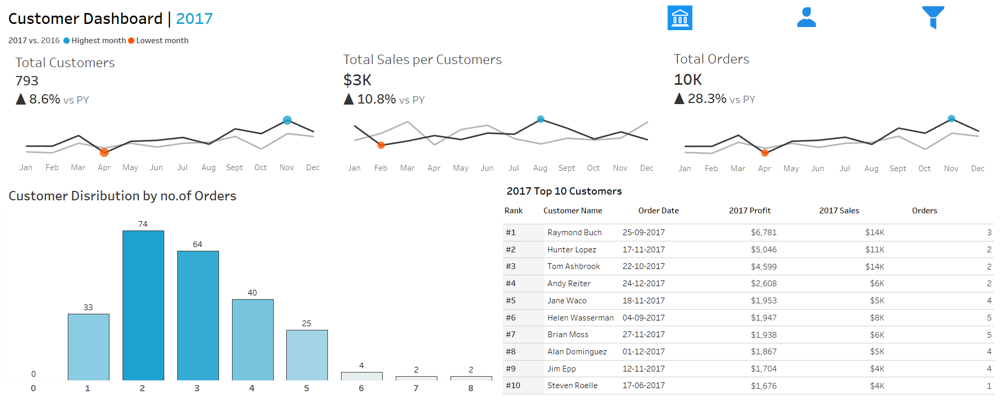
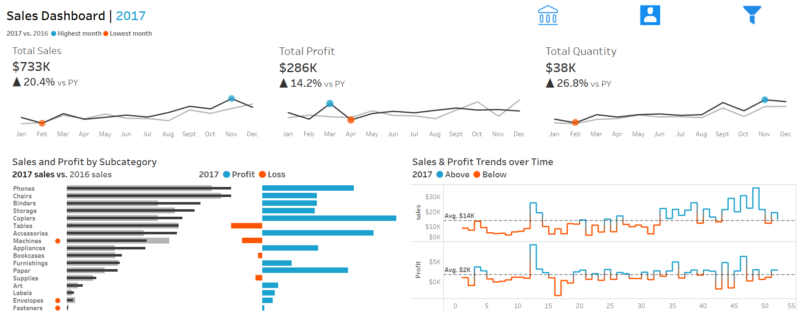

# Superstore-Tableau-Dashboard
Interactive Tableau dashboard analyzing sales and customer insights using Superstore dataset.
📊 **Superstore Sales & Customer Dashboard**

An interactive Tableau project built on the **Superstore dataset** that allows dynamic switching between **Customer Dashboard** and **Sales Dashboard**.  
The dashboard provides deep insights into customer behavior, sales performance, profit trends, and product-level analysis, with an easy-to-use filter panel for drill-down exploration.

🚀 **Project Overview**
- Objective: To analyze customer and sales data in an interactive way, enabling stakeholders to switch between multiple perspectives (customer-focused and sales-focused).  
- Key Features:
  - **Customer Dashboard** – Shows customer distribution, top customers, total orders, and sales per customer.  
  - **Sales Dashboard** – Highlights sales, profit, and quantity trends by sub-category and time.  
  - **Switching Mechanism** – Users can toggle between dashboards seamlessly.  
  - **Filter Panel** – Custom filters for year, product category, sub-category, region, and state to drill down data.  

📸 **Dashboard Preview**  

🔹 **Customer Dashboard**  
  

🔹 **Sales Dashboard**  
  

🔹 **Filter Panel**  
  

🔑 **Insights Gained**
- Identified top-performing customers and their contribution to sales and profit.  
- Discovered monthly sales trends and compared performance year-over-year.  
- Highlighted profitable and loss-making subcategories for better business decisions.    

 📂 **Project Files**
- `dashboard.twbx` → Tableau Packaged Workbook  
- `superstore dataset.xls` → Dataset used  
 

🌐 **Live Dashboard**
👉 [View on Tableau Public](https://public.tableau.com/app/profile/gunti.sharun/viz/dashboard_17578439040770/SalesDashboard?publish=yes&showOnboarding=true)  
  
